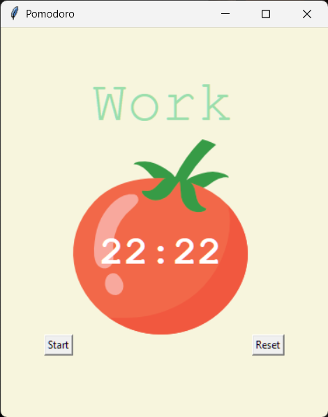

# 🍅 Pomodoro Timer (Python + Tkinter)

A simple desktop Pomodoro Timer application built using **Python** and **Tkinter**.  
This app helps improve focus and productivity by following the **Pomodoro Technique** — timed work sessions followed by short and long breaks.

---

## 🖼️ Application Preview

A screenshot of the application UI is available below:



---

## ✨ Features

- ⏱ 25-minute work sessions
- ☕ 5-minute short breaks
- 💤 20-minute long breaks after every 4 work sessions
- ✔ Visual progress tracking using check marks
- 🔁 Start and reset timer functionality
- 🎨 Clean and minimal Tkinter UI

---

## 🧠 How the Pomodoro Technique Works

1. Work for **25 minutes**
2. Take a **5-minute break**
3. Repeat
4. After 4 work sessions, take a **20-minute long break**

---

## 🛠 Tech Stack

- **Python 3**
- **Tkinter** (GUI)
- **Math module**

---

## 📂 Project Structure

```text
.
├── main.py
├── tomato.png
└── README.md
```

## 🎯 Controls

- Start → Starts the Pomodoro cycle
- Reset → Stops the timer and resets all progress


## 🚀 Future Improvements

- Add Pause / Resume button
- Allow custom timer durations
- Add sound notifications for session completion
- Save session history or productivity stats
- Package the app as a standalone `.exe`
- Improve UI layout and responsiveness


## 📚 Learning Outcomes

- Tkinter GUI development
- Event-driven programming
- Python timing logic using `after()`
- Managing global state in small applications
